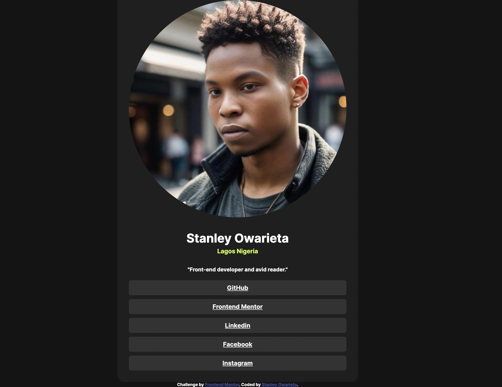

# Frontend Mentor - Social links profile solution

This is a solution to the [Social links profile challenge on Frontend Mentor](https://www.frontendmentor.io/challenges/social-links-profile-UG32l9m6dQ). Frontend Mentor challenges help you improve your coding skills by building realistic projects. 

## Table of contents

- [Overview](#overview)
  - [The challenge](#the-challenge)
  - [Screenshot](#screenshot)
  - [Links](#links)
- [My process](#my-process)
  - [Built with](#built-with)
  - [What I learned](#what-i-learned)
  - [Continued development](#continued-development)
  - [Useful resources](#useful-resources)
- [Author](#author)
- [Acknowledgments](#acknowledgments)

## Overview

### The challenge

Users should be able to:

- See hover and focus states for all interactive elements on the page
- Click any link because i did attached a live link using the anchor tag

### Screenshot




### Links

- Solution URL: [Add solution URL here](https://your-solution-url.com)
- Live Site URL: [Add live site URL here](https://your-live-site-url.com)

## My process

### Built with

- Semantic HTML5 markup
- CSS custom properties
- Flexbox

### What I learned

To be honest at first i wasn't sure of what to do when i first joined the challenge, that was yesterday Monday Apr-8-2024, i just close my computer because i'm still in my programming learning, so today i said let me inspect someone else project online, i didn't copy from her but i did look at her code and write out my own and also fiqure out why it was written that way and why it work and i'm proud of myself because this is something i haven't done before, so thanks to everyone out there putting in the work because this is not easy to understand but something you will love doing by the time you understand the basics and rules of different languages.

```html
<h1>Some HTML code I'm proud of</h1>
```
```css
.proud-of-this-css {
  color: whitesmoke;
  justify-content: center;
  align-items: center;
  flex-direction: column;
}
```


### Continued development

Moving forward, I plan to focus on refining advanced CSS techniques, mastering responsive design principles, and deepening my understanding of accessibility best practices. Additionally, I aim to optimize performance, enhance JavaScript proficiency, strengthen version control skills, and deepen my knowledge of user experience design. These areas will ensure I deliver high-quality, user-centric projects with improved efficiency and effectiveness.

### Useful resources

- The website I inspected was [Omar Ibrahim](https://omaribrahim2002.github.io/Social-Links-Profile/) - It served as a valuable reference for understanding how to initiate my project. I want to clarify that while I reviewed her code for guidance, I didn't copy it. Instead, I analyzed it to comprehend the reasons behind its functionality compared to mine. This comparison helped me identify and rectify errors I encountered. I'm grateful to her for the excellent work she has done on her designs.


## Author

- Linkedin - [Stanley Owarieta](https://www.linkedin.com/in/stanley-owarieta-9127042b7/)
- Frontend Mentor - [Stanley24](https://www.frontendmentor.io/profile/Stanley-24)
- Github - [Stanley Owarieta](https://github.com/Stanley-24)


## Acknowledgments

I extend my sincere thanks to [Dr, Angela Yu](https://www.linkedin.com/in/angela-yu1/) for providing an amazing opportunity and for illuminating a new path in my career. Being one among the 1 million worldwide students learning from her course fills me with pride. Additionally, I express gratitude to all individuals putting in the work to create impactful resources and contribute to the learning community.

Special thanks to [Omar Ibrahim](https://github.com/OmarIbrahim2002)for her exceptional work on her website, which served as a valuable reference point for my project. Your insights have been invaluable.

I also want to thank [Frontend Mentor](https://www.frontendmentor.io/home) for hosting the projects and providing a platform for skill development and collaboration. Your support is deeply appreciated.
